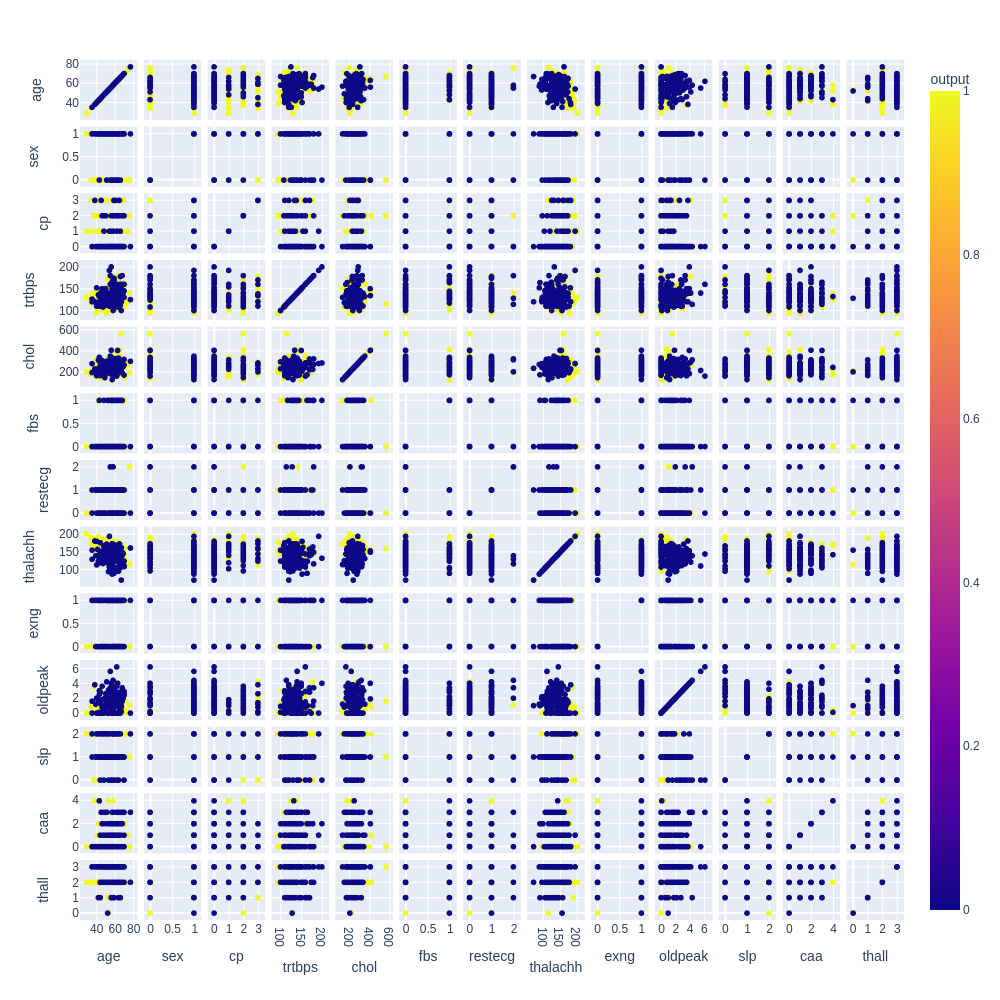

# Heart Disease Prediction

## Project Goal
The goal of this project is to experiment with various machine learning models in order to find one that best predicts if patients have a heart disease based on their properties like age, sex and chest pain.

**View the analysis [here](https://github.com/Vipul97/heart-disease-prediction/blob/main/heart_disease_prediction.ipynb).**

## Data Source
The dataset is available at https://archive.ics.uci.edu/ml/datasets/heart+disease and https://www.kaggle.com/datasets/rashikrahmanpritom/heart-attack-analysis-prediction-dataset.

### Scatterplot Matrix 

## Results
Logistic Regression, KNN Classification, Support Vector Classification and Random Forest Classification all equally give the best test accuracy results of **88.5%**. If accuracy is solely the evaluation metric, it would be preferable to choose **KNN Classification** over others as it is the simplest best performing model that is the easiest to interpret.

|                      Model    |   Accuracy   |  Precision   |    Recall   | F1 Score |  
| -----------------------------:| :----------: | :----------: | :---------: | :-----------------: |
|           Logistic Regression | **0.885246** |   0.903226 	| **0.87500** |    **0.888889** 	  |
|        **KNN Classification** | **0.885246** | **0.962963** |   0.81250   |      0.881356 	    |
| Support Vector Classification | **0.885246** |   0.931034   |   0.84375   |      0.885246 	    |
|  Random Forest Classification | **0.885246** |   0.903226   | **0.87500** |    **0.888889**	    |
|  Decision Tree Classification |   0.704918   |   0.791667   |   0.59375   |	 	   0.678571 	    |
|    Naive Bayes Classification |   0.524590   |   0.800000   |   0.12500   | 	   0.216216 	    |
